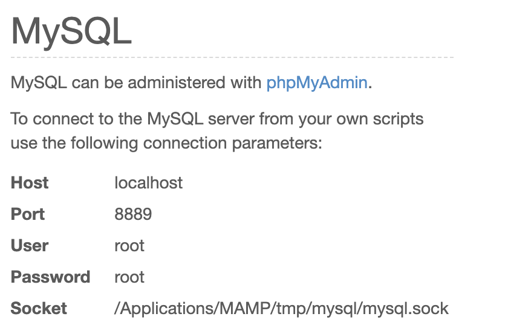

# TDLOG-site-shotgun

Shotgun Web-Site based on data of l'Ecole des Ponts ParisTech, you need to see the installation part to run the code.

<ul>
<li><strong>Introduction</strong></li>
<li><strong>Installation</strong>
<ul> 
<li>Node.Js
<li>MySQL
</ul>
</li>
<li><strong>Quick Start</strong>
</ul>

<h1>Introduction</h1>

The aim of the web-site is to provided to l'Ecole des Ponts ParisTech a way to enable student to choose their languages classes and sport classes fairly thanks an optimization algorithm.

The data from the DataBase provided comes from l'Ecole des Ponts (the classes).

<h1>Installation</h1>

You can install the website thanks git-hub anywhere you want on your computer however you need Node.Js and MySQL to run the code locally. Please read the following parts.
	
<h2>Node.js</h2>
	
The first step is to install Node.js, you can easily managed it with the official website of  <a href = "https://nodejs.org/en/">Node.Js</a>.

<h2>MySQL</h2>

The website runs thanks MySQL as DataBase manager, you can either install it directly from the <a href="https://www.mysql.com/">official website</a> or you can use WAMP or MAMP as well. However be careful when using MAMP you'll need to uncomment the line "socketPath" : 

<pre><code> var con = mysql.createConnection({
	host : 'localhost',
	user : 'root',
	password : 'root',
	//socketPath : '/Applications/MAMP/tmp/mysql/mysql.sock',  //uncomment this line 
								   // if you're using Mamp 
	database : 'shotgun_website'
});
</code></pre>
in the file <strong>model.js</strong>. If it doesn't work go on the WebStart page of MAMP and change the path with the indication provided here :

After this step do note forget to import the database <strong>_DATABASE_shotgun_.sql</strong> in MySQL.

<h1>Quick Start</h1>

To run the code simply use this command in your terminal (Mac0S or Linux otherwise use the Node.Js terminal) : 
<pre><code> node app.js
</code></pre>
Then browse the url : <a href="http://localhost:8080/shotgun">http://localhost:8080/shotgun</a>.
